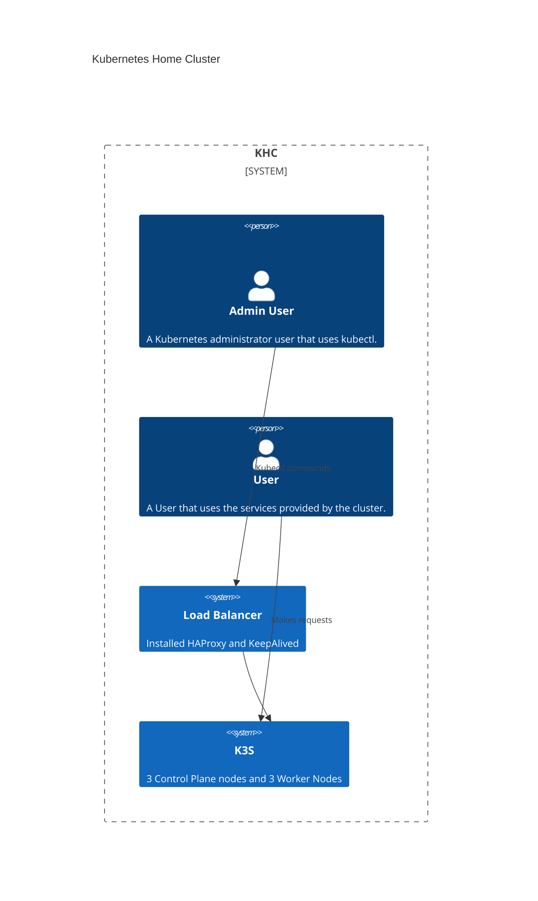

# Architecture

```mermaid

C4Context
  title Kubernetes Home Cluster
  System_Boundary(b0, "KHC") {
    Person(UserAadmin, "Admin User", "A Kubernetes administrator user that uses kubectl.")
    Person(User, "User", "A User that uses the services provided by the cluster.")
    System(SystemLB, "Load Balancer", "Installed HAProxy and KeepAlived")
    System(K3S, "K3S",  "3 Control Plane nodes and 3 Worker Nodes")
  }

  Rel(UserAadmin, SystemLB, "Kubectl commands")
  Rel(User, K3S, "Makes requests")
  Rel(SystemLB, K3S,"")

  UpdateElementStyle(UserAadmin,$shadowing="true",$sprite="robot")
  UpdateLayoutConfig($c4ShapeInRow="2", $c4BoundaryInRow="1")
```
