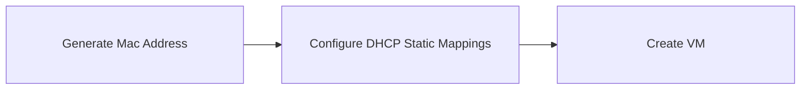
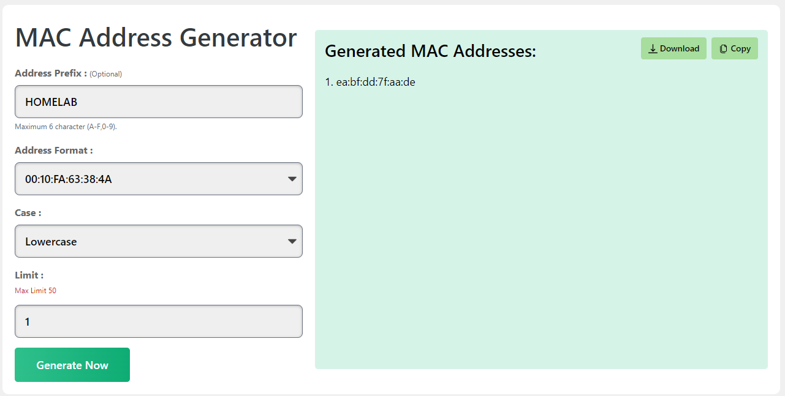
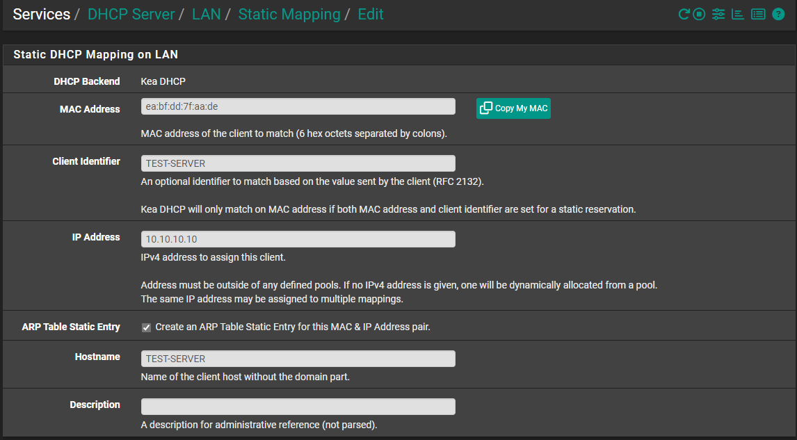
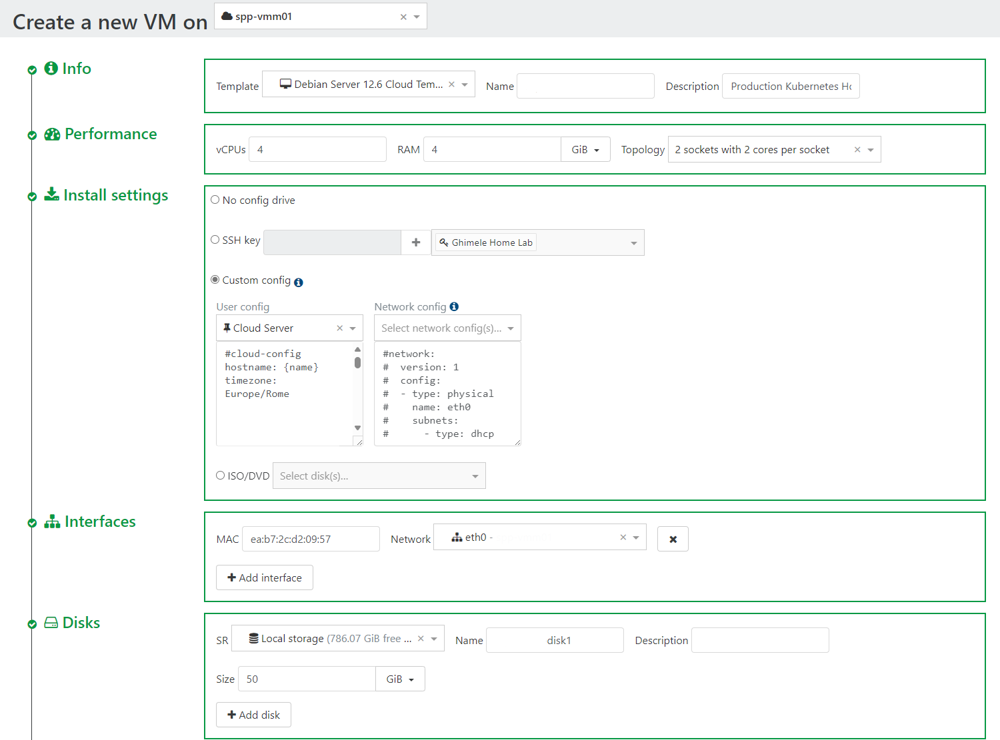
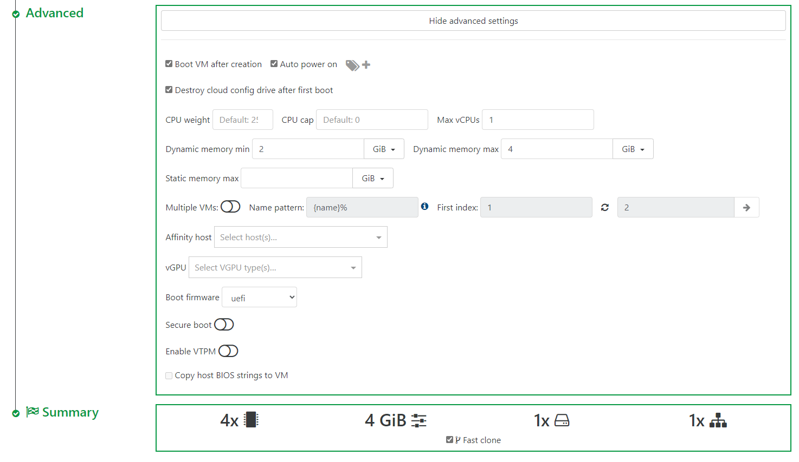
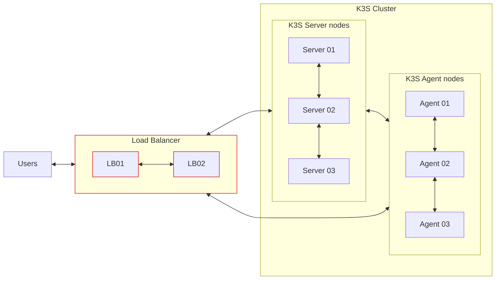
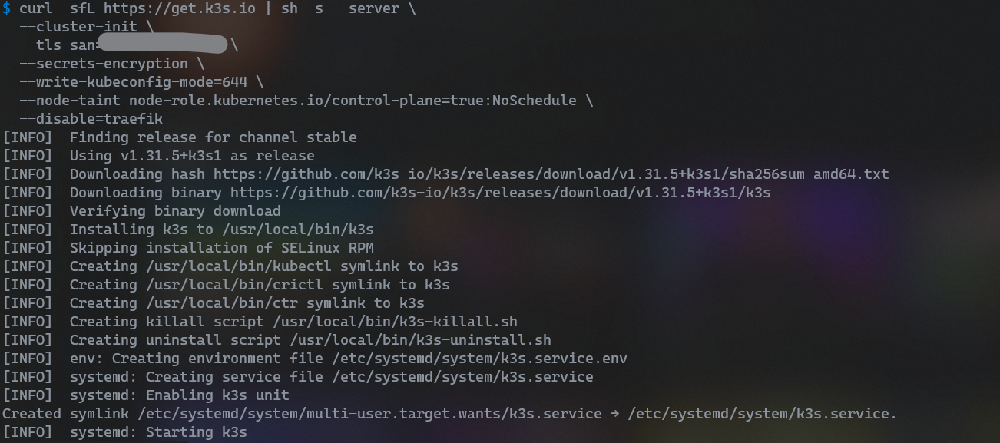
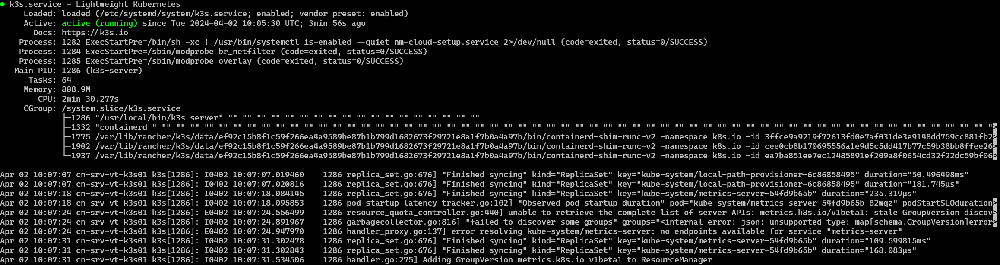
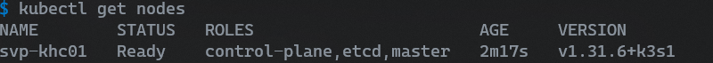

# Intstallation

My cluster runs in a virtual environment managed by xcp-ng [XCP-ng](https://xcp-ng.org/) and [Xen Orchestra](https://xen-orchestra.com/#!/xo-features/webinterface)
To install a new cluster we need first to create the virtual machine nodes that will manage the workload.

The below chart describes the steps to be done before to create a new VM



## Pfsense configuration

All the servers configured iniside the home lab are using **`static dhcp lease`** [^1].
We need to configure the static lease in [PfSense](https://www.pfsense.org/) before to create the VM.

1. Generate a new mac address [MAC Address Generator](https://macaddresslookup.io/mac-address-generator)
   - Address Prefix: HOMELAB
   - Address format: choose the Colon-Hexadecimal notation = BA:20:C1:AD:7D:6A
   - Case: Lowercase
   - Limit: 1


2. In pfsense use this new Mac Address to create a static lease
   - Services / DHCP Server / LAN / Static Mapping
   - Push the button "+ Add Static Mapping"
   - Fill in the form and add as mac address the one you created before in step 1.


3. Now is possible to create the VM in Xen Orchestra using the Mac Address created in section 1.

svp-khc01
ea:bf:dd:7f:aa:de
Production Kubernetes Home Cluster 01

## Xen-Orchestra

In Xen Orchestra we need to create at least 3 VMs, one will be the controller and the other 2 nodes will be the workers.
In Xen Orchestra I've created a template that uses [cloud-init](https://cloudinit.readthedocs.io/en/latest/index.html) in this way the first initialisation is done automatically. The cloud-init configuration uses an [Ansible](https://docs.ansible.com/ansible/latest/index.html#) playbook to automate the installation of the core server components.





## K3S installation



### K3S Server Nodes

K3S [^2] can be deployes in different way. I will deploy K3S in **High Availability** mode using the embedded **etcd** datastore.  In addition we are going to implement extra configuration like I will disable traefik, because we will install later on.

#### Install the First Server node

On the first node execute the following command:

```bash
curl -sfL https://get.k3s.io | sh -s - server \
  --cluster-init \
  --tls-san=192.168.10.100 \
  --secrets-encryption \
  --write-kubeconfig-mode=644 \
  --node-taint node-role.kubernetes.io/control-plane=true:NoSchedule \
  --disable=traefik \
  --disable=servicelb
```

The following table describes the option used:

| Flag | Value | Description |
| ---- | ----- | ----------- |
| cluster-init | | (cluster) Initialize a new cluster using embedded Etcd |
| tls-san | IP ADDRESS of the load balancer server | Add additional hostnames or IPv4/IPv6 addresses as Subject Alternative Names on the server TLS cert |
| secrets-encryption | | Enable secret encryption at rest |
| write-kubeconfig-mode | 644 | Write kubeconfig with this mode. The kubeconfig file is owned by root, and written with a default mode of 600. Changing the mode to 644 will allow it to be read by other unprivileged users on the host.|
| node-taint | node-role.kubernetes.io/control-plane=true:NoSchedule | I don't want any work loads/pod scheduled on my master node other than what the master needs. |
| disable | traefik | Disable traefik from being installed. Multiple items can be disabled by separating their names with commas, or by repeating the flag.|
| disable | servicelb | Disable ServiceLB from being installed. configure all servers in the cluster with the --disable=servicelb flag. |



Perfect, above output confirms that script has been executed successfully. Next check the status of K3s using the following command:

```bash
sudo systemctl status k3s
```

If everything is working correctly, you should see a status message indicating that K3s is active and running.


Then you can check the status of the kubernetes nodes using the following command:

```bash
kubectl get nodes
```



#### Add additional servers

After launching the first server, join the second and third servers to the cluster.

On the first server run the following command to get the token and use it to join the other servers

```bash
sudo cat /var/lib/rancher/k3s/server/token
```

Run the following command to join the other servers:

```bash
curl -sfL https://get.k3s.io | K3S_TOKEN=<Token got before> sh -s - server \
  --server https://192.168.10.100:6443 \
  --tls-san=192.168.10.100 \
  --secrets-encryption \
  --write-kubeconfig-mode=644 \
  --node-taint node-role.kubernetes.io/control-plane=true:NoSchedule \
  --disable=traefik \
  --disable=servicelb
```

### K3S Worker node

To install additional agent nodes [^2] and add them to the cluster, run the installation script with the K3S_URL and K3S_TOKEN environment variables. Here is an example showing how to join an agent:

```bash
curl -sfL https://get.k3s.io | K3S_TOKEN=SECRET sh -s - agent \
  --server https://<ip or hostname of server>:6443 \
  --node-label node-role.kubernetes.io/postgres= \
  --node-label node-role.kubernetes.io/longhorn= 
```

Setting the K3S_URL parameter causes the installer to configure K3s as an agent, instead of a server. The K3s agent will register with the K3s server listening at the supplied URL. The value to use for K3S_TOKEN is stored at /var/lib/rancher/k3s/server/node-token on your server node.

#### Label nodes

We need to add some label to the nodes to assign the pods related to Longhorn and CNPG just to some specific worker node.

##### CloudNativePG

CloudNativePG recommends using the node-role.kubernetes.io/postgres label. Since this is a reserved label (*.kubernetes.io), it can only be applied after a worker node is created.

To assign the postgres label to a node, use the following command:

```bash
kubectl label node <NODE-NAME> node-role.kubernetes.io/postgres=
```

##### Longhorn

To assign the longhorn label to a node, use the following command:

```bash
kubectl label node <NODE-NAME> node-role.kubernetes.io/longhorn=
```

Before to install Longhorn we need to preapere the nodes, it is important to have the /mnt/longhorn-data folder available, in my configuration I've used an LVM and I mount the lvm to the /mnt/longhorn-data folder.
It is also important to check the Longhorn Installation Requirements[^7]

## FLuxcd installation

Install Flux[^3] using the following script.

```bash
curl -s https://fluxcd.io/install.sh | sudo bash
```

To configure your shell to load flux bash completions add to your profile:

```bash
. <(flux completion bash)
```

### Bootstrap

The flux bootstrap[^4] github command deploys the Flux controllers on a Kubernetes cluster and configures the controllers to sync the cluster state from a GitHub repository.

We need to create a GitHub PAT[^5] first and it needs to be exported as an environment variable:

``bash
export GITHUB_TOKEN=<gh-token>
``

Then is possible to run the bootstrap[^6] for a repository on your personal GitHub account, in addition we had the image automation components because they are not installed by default.

```bash
flux bootstrap github \
  --components-extra=image-reflector-controller,image-automation-controller \
  --token-auth \
  --owner=my-github-username \
  --repository=my-repository-name \
  --branch=main \
  --path=clusters/my-cluster \
  --read-write-key \
  --personal
```

The bootstrap command creates a repository if one doesn’t exist, and commits the manifests for the Flux components to the default branch at the specified path. It then configures the target cluster to synchronize with the specified path inside the repository.

## References

[^1]: [DHCP Static Lease](adr/ADR-006-DHCP-Static-Lease.md)
[^2]: [K3S Install](https://docs.k3s.io/quick-start)
[^3]: [Flux Install](https://fluxcd.io/flux/installation/)
[^4]: [Flux Bootstrap](https://fluxcd.io/flux/installation/bootstrap/github/)
[^5]: [GitHub PAT](https://docs.github.com/en/authentication/keeping-your-account-and-data-secure/managing-your-personal-access-tokens)
[^6]: [Flux Bootstrap](https://fluxcd.io/flux/installation/bootstrap/github/)
[^7]: [Longhorn Installation Requirements](https://longhorn.io/docs/1.8.0/deploy/install/#installation-requirements)
