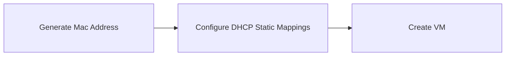
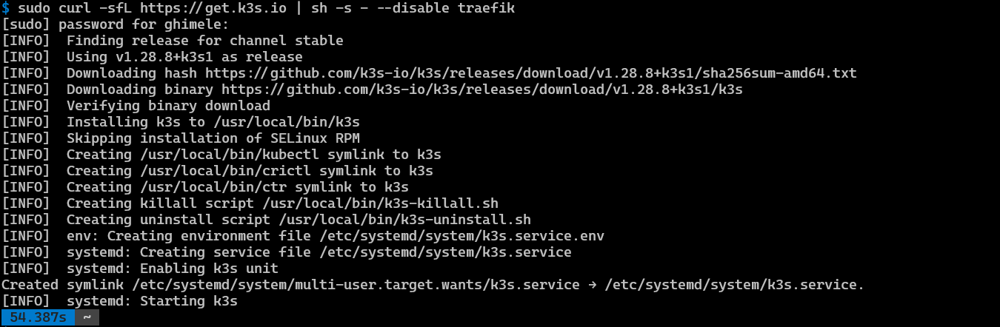

# Intstallation

My cluster runs in a virtual environment managed by xcp-ng [XCP-ng](https://xcp-ng.org/) and [Xen Orchestra](https://xen-orchestra.com/#!/xo-features/webinterface)
To install a new cluster we need first to create the virtual machine nodes that will manage the workload.

The below chart describes the steps to be done before to create a new VM



## Pfsense configuration

All the servers configured iniside the home lab are using **`static dhcp lease`** [^1].
We need to configure the static lease in [PfSense](https://www.pfsense.org/) before to create the VM.

1. Generate a new mac address [MAC Address Generator](https://macaddresslookup.io/mac-address-generator)
   - Address Prefix: HOMELAB
   - Address format: choose the Colon-Hexadecimal notation = BA:20:C1:AD:7D:6A
   - Case: Lowercase
   - Limit: 1


2. In pfsense use this new Mac Address to create a static lease
   - Services / DHCP Server / LAN / Static Mapping
   - Push the button "+ Add Static Mapping"
   - Fill in the form and add as mac address the one you created before in step 1.


3. Now is possible to create the VM in Xen Orchestra using the Mac Address created in section 1.

svp-khc01
ea:bf:dd:7f:aa:de
Production Kubernetes Home Cluster 01

## Xen-Orchestra

In Xen Orchestra we need to create at least 3 VMs, one will be the controller and the other 2 nodes will be the workers.
In Xen Orchestra I've created a template that uses [cloud-init](https://cloudinit.readthedocs.io/en/latest/index.html) in this way the first initialisation is done automatically.
The cloud-init configuration uses an [Ansible](https://docs.ansible.com/ansible/latest/index.html#) playbook to automate the installation of the core server components.


## K3S installation

### K3S Controller

We install K3S [^2] without traefik, because we will install later on.
K3s offers several different ways to configure the installation, either with flags or environment variables. The easiest is to append --disable traefik:

```bash
curl -sfL https://get.k3s.io | sh -s - --disable traefik
```



Perfect, above output confirms that script has been executed successfully. Next check the status of K3s using the following command:

```bash
sudo systemctl status k3s
```

If everything is working correctly, you should see a status message indicating that K3s is active and running.


### K3S Worker node

To install additional agent nodes [^2] and add them to the cluster, run the installation script with the K3S_URL and K3S_TOKEN environment variables. Here is an example showing how to join an agent:

```bash
curl -sfL https://get.k3s.io | K3S_TOKEN=SECRET sh -s - agent --server https://<ip or hostname of server>:6443
```

Setting the K3S_URL parameter causes the installer to configure K3s as an agent, instead of a server.
The K3s agent will register with the K3s server listening at the supplied URL. The value to use for K3S_TOKEN is stored at /var/lib/rancher/k3s/server/node-token on your server node.

## FLuxcd installation

Install Flux[^3] using the following script.

```bash
curl -s https://fluxcd.io/install.sh | sudo bash
```

To configure your shell to load flux bash completions add to your profile:

```bash
. <(flux completion bash)
```

### Bootstrap

The flux bootstrap[^4] github command deploys the Flux controllers on a Kubernetes cluster and configures the controllers to sync the cluster state from a GitHub repository.

We need to create a GitHub PAT[^5] first and it needs to be exported as an environment variable:

``bash
export GITHUB_TOKEN=<gh-token>
``

Then is possible to run the bootstrap[^6] for a repository on your personal GitHub account, in addition we had the image automation components because they are not installed by default.

```bash
flux bootstrap github \
  --components-extra=image-reflector-controller,image-automation-controller \
  --token-auth \
  --owner=my-github-username \
  --repository=my-repository-name \
  --branch=main \
  --path=clusters/my-cluster \
  --read-write-key \
  --personal
```

The bootstrap command creates a repository if one doesn’t exist, and commits the manifests for the Flux components to the default branch at the specified path. It then configures the target cluster to synchronize with the specified path inside the repository.

## References

[^1]: [DHCP Static Lease](adr/ADR-006-DHCP-Static-Lease.md)
[^2]: [K3S Install](https://docs.k3s.io/quick-start)
[^3]: [Flux Install](https://fluxcd.io/flux/installation/)
[^4]: [Flux Bootstrap](https://fluxcd.io/flux/installation/bootstrap/github/)
[^5]: [GitHub PAT](https://docs.github.com/en/authentication/keeping-your-account-and-data-secure/managing-your-personal-access-tokens)
[^6]: [Flux Bootstrap](https://fluxcd.io/flux/installation/bootstrap/github/)
